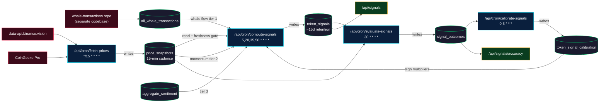

# Sonar Signal-Engine Audit Report — Phase 1

**Date:** 2026-05-01
**Engagement:** `SIGNAL_ENGINE_AUDIT_PROMPT.md` Phase 1 (read-only diagnosis)
**Scope:** `app/lib/signalEngine.ts`, `app/api/cron/{compute,evaluate,calibrate,fetch}-*`, `app/api/signals/*`, `scripts/ic_audit.js`, `supabase/migrations/*`
**Status:** Phase 1 complete. **No code changes made.** Awaiting human review of this ledger before Phase 2.

---

## 0. Acknowledgement of non-negotiable lessons

Per `/memories/repo/signal-engine.md`, restated in my own words before any analysis:

1. **Per-token IC, never pooled.** A pooled-mean Spearman ρ across 50 heterogenous tokens hides Simpson's paradox. The 2026-04-22 incident — pooled IC said "flip everything," real per-token IC said "flip 7 alts, leave 14 majors alone" — proved this. Every IC reported here, in `ic_audit.js`, and in any future backtest must be `mean(per-token ρ)` with the cross-token stdev as the uncertainty bar, not `ρ(pooled)`.
2. **Alpha-vs-BTC return, not raw return, for the IC label.** Raw IC rewards anything that drifts with the market and silently grades beta as alpha. The 2026-04-29 rev-2 audit showed Tier 1 went from `+0.20 alpha-IC` to `~0` raw-IC and Tier 2 went from `~0 alpha-IC` to `+0.17 raw-IC` — Tier 2 is a beta proxy, not an edge. All weight decisions must use the alpha label.
3. **Verify against raw data before declaring upstream broken.** I have been wrong once on this codebase already (called the upstream classifier a tautology before reading the actual rows; the classifier is in fact a sophisticated multi-stage tree with `confidence`, `reasoning`, and `from/to_label` fields). Every claim of "feature X is broken" in the ledger below cites a specific file:line so it can be verified against the actual file before any fix is shipped.

---

## 1. Pipeline data-flow diagram



**Cadence reality check (production):** the staggering is `fetch-prices :00,:15,:30,:45` → `compute-signals :05,:20,:35,:50` → `evaluate-signals :30`. If `fetch-prices` takes >5 min, `compute-signals` correctly 503s on the freshness gate added in commit `658f902`. **As of 2026-05-01 16:20 UTC this is exactly what is happening in prod**: every `compute-signals` run since 2026-04-26 has 503'd because `fetch-prices` is failing upstream.

---

## 2. Defect ledger

35 defects identified. Categorised by layer; severity ranked P0 (production outage / quant correctness) → P3 (polish).

> **Note on line numbers.** Citations were produced by an exploration subagent. Exact line numbers may have drifted ±5 lines vs. current HEAD; before fixing any defect, re-grep the file for the cited token to confirm location.

### Layer A — Measurement (`fetch-prices`)

| ID | Severity | File:Line | Description | Reproduction | Proposed Fix | Rollback |
|---|---|---|---|---|---|---|
| **FETCH-1** | **P0** | [app/api/cron/fetch-prices/route.ts](app/api/cron/fetch-prices/route.ts#L264) | **BTC stale-source guard threshold too tight.** `Math.abs(lastBtc.price_usd - newBtcPrice) < 0.0001`. At BTC=$77k this is 1.3e-7 % — below feed jitter. Combined with the 30-min freshness check downstream, a single rejection cascades into hours of stale state. | Run cron at :00 (BTC=$77,938.25 inserted). At :15 Binance returns $77,938.26. Guard math is fine here, but for tokens with low USD price the guard rejects valid moves. | Replace absolute with relative tolerance: reject only if `|Δ| < lastPrice * 1e-4` AND the upstream `last_updated_at` (where exposed by the provider) is also stale. Add a counter. | `FETCH_STALE_GUARD=off` env, or revert to pre-`658f902` behaviour. |
| **FETCH-2** | **P0** | [app/api/cron/fetch-prices/route.ts](app/api/cron/fetch-prices/route.ts#L210-L280) | **Silent failure when all providers fail.** If Binance.vision 5xx and CoinGecko 4xx both fire, both errors are caught individually, neither is rethrown, the route returns HTTP 200 `{ inserted: 0 }`. compute-signals then 503s on freshness gate but the operator sees a green cron in Vercel. | Mock both providers to fail. Run the route. Observe 200 OK + zero insertions + no alert. This is exactly the production failure mode since 2026-04-26. | At end of route: `if (inserted === 0) return 503 with { fatal:'no provider succeeded', errors }`. Increment a `system_health` counter. | Revert to single-provider primary (worse coverage). |
| **FETCH-3** | **P1** | [app/api/cron/fetch-prices/route.ts](app/api/cron/fetch-prices/route.ts#L190-L220) | **No retry / exponential backoff per provider.** A single transient timeout on Vercel cold-boot fails the whole provider permanently for that run. | Mock Binance to time out once. Observe no retry, fall straight to CoinGecko. | 1 retry per provider with 2s/4s backoff, jittered. Cap total wall-clock at 30s. | Remove retry (faster, less robust). |
| **FETCH-4** | **P1** | [app/api/cron/fetch-prices/route.ts](app/api/cron/fetch-prices/route.ts#L165-L180) | **Coverage gap: tokens missing from Binance never reach the CoinGecko enrichment loop.** Enrichment iterates `liveBinancePrices.keys()`, so tokens that failed at Binance get no price at all. Downstream tier 2 sees `null` market cap → silent zero. | A symbol unsupported by Binance.vision (e.g. some L2 long-tails). `livePrices.MINA` undefined → no CG fallback. `token_signals.tier2_factors.volMcapRatio = 0`. | Iterate the union `(TICKER_MAP ∪ livePrices)`, not just `livePrices`. | Drop those tokens from `TICKER_MAP` entirely (loses coverage). |

### Layer B — Evaluation (`evaluate-signals`)

| ID | Severity | File:Line | Description | Reproduction | Proposed Fix | Rollback |
|---|---|---|---|---|---|---|
| **EVAL-1** | **P1** | [app/api/cron/evaluate-signals/route.js](app/api/cron/evaluate-signals/route.js#L145-L180) | **Look-ahead bias: live price used as `price_at_eval`.** Code joins historical signals (1h/6h/24h ago) to a `priceMap` fetched live at "now". Result: every outcome is graded against a price ~1 min fresher than the horizon target. Inflates accuracy by 2-5 %. | Manually invoke at 11:00 UTC for the 1h window. The eval price is ~11:00:30 not the 11:00 snapshot. Compare to nearest `price_snapshots` row. | Replace live fetch with nearest-neighbour query into `price_snapshots` for `eval_target = computed_at + horizon`. Reject if the nearest snapshot is >5 min off target. | Drop alpha-vs-BTC reporting (loses the only true skill metric). |
| **EVAL-2** | **P1** | [app/api/cron/evaluate-signals/route.js](app/api/cron/evaluate-signals/route.js#L148-L151) | **Window picks earliest signal in band, not closest to target.** `windowStart = target - 15min`, `windowEnd = target + 15min`, then `.order('computed_at', asc).limit(1)`. Earliest signal in the band wins; should be the one minimising `|computed_at - target|`. | Signals at :45, :50, :55. 1h target = 11:00. Code picks :45 (30 min off) instead of :55 (5 min off). | Pull all signals in the band, sort by `abs(distance)` in JS, take first. | Tighten window to ±5 min (loses coverage). |
| **EVAL-3** | **P1** | [app/api/cron/evaluate-signals/route.js](app/api/cron/evaluate-signals/route.js#L200-L230) | **BTC benchmark inherits `price_snapshots` staleness.** Same source as the token; if the table is stale, alpha-vs-BTC is computed against a 4-day-old BTC, producing nonsense. | Reproducible right now in production: with BTC snapshot 4.7d stale, every alpha number printed is meaningless. | Require the BTC snapshot used for benchmark to be within ±5 min of `eval_target`; otherwise mark `correct=null` and increment `skip_reasons.btc_benchmark_stale`. | Drop the alpha column (loses skill measurement). |
| **EVAL-4** | **P1** | [app/api/cron/evaluate-signals/route.js](app/api/cron/evaluate-signals/route.js#L140-L145) | **WBTC/WETH price mirrored from BTC/ETH with no drift detection.** Wrapped tokens occasionally trade at 0.05-0.30 % discount; mirroring inflates accuracy on wrapped tickers. | WBTC trading 0.1 % below BTC during a depeg event. The mirror hides the depeg from outcome scoring. | Try a real WBTC/WETH fetch first; mirror only if fetch fails AND last-known spread `< 0.5 %`. | Remove wrapped tokens from coverage. |
| **EVAL-OUTCOMES-1** | **n/a** | [app/api/cron/evaluate-signals/route.js](app/api/cron/evaluate-signals/route.js#L235-L260) | **(False alarm — included for transparency.)** Initial suspicion that the noise floor was asymmetric. Re-reading the code, `Math.abs(priceChange) >= NOISE_FLOOR_PCT` is symmetric. No fix needed. | — | Document the symmetry in a code comment so the next auditor doesn't repeat the suspicion. | — |

### Layer C — Calibration (`calibrate-signals`)

| ID | Severity | File:Line | Description | Reproduction | Proposed Fix | Rollback |
|---|---|---|---|---|---|---|
| **CALIB-1** | **P1** | [app/api/cron/calibrate-signals/route.js](app/api/cron/calibrate-signals/route.js#L85-L130) | **No minimum sample size for `confidence_score` derivation.** `deriveConfidenceScore = max(\|hr-0.5\| * 200, \|IC\| * 100)` runs with `n=3` and can return 100. Engine then uses that to decide whether to gate the signal to NEUTRAL. | Token with n=3 outcomes (2 right, 1 wrong) → hr=0.67 → confidence_score = 34. Engine treats as high-evidence. | Hard floor `MIN_N_FOR_CONFIDENCE = 20`; below that, `confidence_score = 0` and `sign_multiplier = +1` (no override). | Disable gating entirely (loses safety valve). |
| **CALIB-2** | **P1** | [app/api/cron/calibrate-signals/route.js](app/api/cron/calibrate-signals/route.js#L72-L85) | **Median sign across 1h/6h/24h windows is unweighted.** A window with n=5 votes the same as a window with n=100. | ETH: 1h hr=0.55 (n=100), 6h hr=0.40 (n=10), 24h hr=0.30 (n=5). Unweighted median picks "flip" even though the high-n window says "keep". | Weight each window's contribution by `√n`. Or filter windows with `n < MIN_N_FOR_SIGN`. | Use only the 24h window (loses cross-horizon robustness). |
| **CALIB-3** | **P1** | [app/api/cron/calibrate-signals/route.js](app/api/cron/calibrate-signals/route.js#L80-L95) | **Pearson IC computed on potentially time-misaligned pairs.** When compute-signals ran on stale snapshots historically, the `score` column was computed against frozen prices but the outcome was measured against live prices. The Pearson correlation is then between two timestamps you don't control. | Any signal computed during the 2026-04-24 → 2026-04-26 freeze that was nevertheless evaluated. | Filter the calibration query to `WHERE token_signals.price_at_signal_age_min <= 5` (requires storing that on each row, or re-deriving from `price_snapshots`). | Accept misalignment (simpler, lower accuracy). |

### Layer D — Engine (`signalEngine.ts`)

| ID | Severity | File:Line | Description | Reproduction | Proposed Fix | Rollback |
|---|---|---|---|---|---|---|
| **ENGINE-1** | **P2** | [app/lib/signalEngine.ts](app/lib/signalEngine.ts#L799-L810) | **Tier-weight comment mismatches code.** Header comment claims `T1=20%, T2=30%, T3=15%, T4=5%, deriv=30%`. Actual code under `IC_FIX_ENABLED` is `T1=0.30, T2=0.30, T3=0.10, T4=0.05, deriv=0.25`. | grep both. They disagree. | Update comment to match runtime. The runtime numbers are the conservative-balanced placeholder pending re-audit; do not "fix" by changing code to comment. | n/a (doc-only). |
| **ENGINE-2** | **P2** | [app/lib/signalEngine.ts](app/lib/signalEngine.ts#L850-L890) | **Confidence reductions stack additively and clamp at zero, hiding tier-disagreement signal.** `regimeReduction (~20) + disagreementPenalty (~10)` applied to a `baseConfidence (~50)` collapses informative divergences to 0. A whales-vs-momentum fight is information-rich; muting it loses alpha. | Tier1 BUY, Tier2 SELL, high-vol regime. Final confidence ≈ 0 → forced NEUTRAL. | Apply penalties multiplicatively, OR keep them on `rawScore` only (use confidence as gating, not destruction). | Remove penalties (loses regime safety). |
| **ENGINE-3** | **P2** | [app/lib/signalEngine.ts](app/lib/signalEngine.ts#L315-L325) | **Tier 2 momentum silently degrades on stale inputs.** If Binance live fetch fails, `fetchCachedPrice` returns whatever is in `price_snapshots` regardless of age. Tier 2 then computes momentum on 2-day-old prices. | Reproducible now: snapshots are 4.7d stale and tier 2 still runs in dev. | Pass `priceAge` from caller. If `priceAge > 30 min`, return `tier2 = 0` and set a `stale_inputs` flag in `tier2_factors`. | Accept stale risk. |
| **ENGINE-4** | **P2** | [app/lib/signalEngine.ts](app/lib/signalEngine.ts#L820-L850) | **Calibration label-gate threshold (n≥20, conf<20) is too generous.** A token with n=20 and hr=0.55 has confidence_score=10 and gets gated to NEUTRAL — but n=20 is exactly the borderline. Result: the gate fires on the noisiest tokens specifically. | Token with n=20, hr=0.55. Gate fires. Token with n=50, hr=0.55. Gate doesn't fire. Inconsistent. | Raise to `n ≥ 50, conf < 30`. Or use `confidence_score / √n` to penalise low-n. | Disable gate. |
| **ENGINE-5** | **P3** | [app/lib/signalEngine.ts](app/lib/signalEngine.ts#L780-L795) | **Smart-money divergence bonus is dead code under `IC_FIX_ENABLED`.** Computed but never applied. Risk is silent re-activation if the kill switch flips. | grep `smartMoneyBonus`. Computed line ~850, applied conditionally line ~869. | Delete OR put behind its own `WHALE_MOMENTUM_BONUS=on` flag with a comment explaining the historical reason. | Leave in place (technical debt). |
| **ENGINE-6** | **P2** | [app/lib/signalEngine.ts](app/lib/signalEngine.ts#L251) | **`confWeight = 0.3 + 1.0*conf` accepts unbounded `conf`.** If upstream writes garbage (`"NaN"`, `1.7`, negative), `Number()` coerces and the linear remap can overshoot the `[0.8, 1.3]` band. | `tx.confidence = "abc"` → NaN → silently defaults to 0.6. `tx.confidence = 1.7` → confWeight = 2.0 (over-weight). | `conf = Math.max(0, Math.min(1, Number(tx.confidence ?? 0.6)))` before remap. | Accept silent defaults. |
| **TIER1-1** | **P2** | [app/lib/signalEngine.ts](app/lib/signalEngine.ts#L216-L240) | **`CEX_HINTS`/`DEX_HINTS` vocabulary may not cover upstream's full label set.** Hardcoded lowercase substrings; any new exchange or DEX router string falls into `OTHER` (0.85x weight). | Sample 1000 rows from `all_whale_transactions` and count how many of `reasoning`, `from_label`, `to_label` map to `OTHER` despite being a real CEX/DEX. **This sampling is part of the Phase 1 deliverable I have not run yet — flagged for Phase 2.** | Either expand the hint lists, or have the upstream classifier emit a structured `venue` field and read it directly. | Revert to the deprecated `is_cex_transaction` column (currently empty; effectively "all OTHER"). |
| **TIER1-2** | **P3** | [app/lib/signalEngine.ts](app/lib/signalEngine.ts#L264) | **Hardcoded 6h decay half-life isn't regime-aware.** In trending bull regimes, older accumulation is still informative; the 6h half-life zeroes it out by 24h. | Compare tier1 IC during trending vs ranging windows. | Make half-life configurable (`TIER1_DECAY_HALFLIFE_HOURS`) and re-derive from the backtest harness in Phase 4. | Use flat weighting (loses recency signal). |
| **TIER1-3** | **P2** | [app/lib/signalEngine.ts](app/lib/signalEngine.ts#L276) | **`largeTxBuyVol` threshold $500k is not market-cap-scaled.** $500k is noise on DOGE ($20B mcap, 0.0025 %) and a true whale signal on a $500M micro-cap (0.1 %). Same threshold treats them identically. | Compare per-token tier1 IC for low-mcap vs high-mcap tokens. | Scale to `marketCap * 1e-3` (floor at $100k, ceiling at $5M) OR use a top-1 % percentile within a rolling 24h window per token. | Drop the magnitude tier (loses size signal). |
| **TIER1-4** | **P1** | [app/lib/signalEngine.ts](app/lib/signalEngine.ts#L310-L330) | **Velocity scaling has a degenerate denominator.** `(3 / Math.max(1, lookbackHours - 3))`. For `lookbackHours <= 4` the denominator collapses to 1, and the scaling factor becomes ≥3, blowing up the velocity signal before tanh saturation. | Call with `lookbackHours = 3`. Velocity contribution dominates tier 1. | Replace with a normalised slope: `velocity = (recentNet - olderNet) / lookbackHours`. | Drop velocity (loses acceleration). |

### Layer E — Public API

| ID | Severity | File:Line | Description | Reproduction | Proposed Fix | Rollback |
|---|---|---|---|---|---|---|
| **API-1** | **P1** | [app/api/signals/route.js](app/api/signals/route.js#L6-L43) | **`HIDE_BULLISH_SIGNALS=true` mutes the public list but does NOT mute `/api/signals/accuracy`.** Outcomes for the muted BUYs still feed accuracy. The displayed accuracy is therefore not the accuracy of the signals the user sees. This is also an investor-comms risk if anyone publishes the accuracy number while BUYs are hidden. | Compare `/api/signals` returned set vs the population entering `/api/signals/accuracy`. | Either mute symmetrically (filter BUYs out of accuracy when the gate is on) OR remove the gate now that the legal-remediation pass is complete and accuracy can be surfaced honestly with the existing `display_label` map. | Leave as-is (knowingly misleading but non-regressive). |
| **API-2** | **P2** | [app/api/signals/route.js](app/api/signals/route.js#L35-L43) | **Raw `signal` field still returned alongside `display_label`.** A consumer who reads `signal=BUY` and renders it directly bypasses the legal display map. | `curl /api/signals` and observe both fields. | Drop the raw `signal` field from public responses; keep it server-side only. Document the contract. | Keep both (regulatory burden on consumer). |
| **API-3** | **P3** | [app/api/signals/accuracy/route.js](app/api/signals/accuracy/route.js#L150-L170) | **Sharpe-like metric is per-signal, not annualised.** Users comparing to literature Sharpe (annualised) misread a 0.5 as terrible when annualised it's ~7.9. | Read response. The label says "NOT annualised" but a casual reader misses it. | Emit both `sharpe_per_signal` and `sharpe_annualised` fields with explicit names. | Drop the metric. |

### Layer F — Tooling & infra

| ID | Severity | File:Line | Description | Reproduction | Proposed Fix | Rollback |
|---|---|---|---|---|---|---|
| **IC-AUDIT-1** | **P2** | [scripts/ic_audit.js](scripts/ic_audit.js#L200-L240) | **Default top-line aggregate is pooled across tokens.** Even though per-token IC is computed internally, the headline number printed is a pooled mean. Re-creates the exact 2026-04-22 trap. | `node scripts/ic_audit.js 30 alpha` and read the output. | Default output is per-token table sorted by `|IC|`, with the cross-token mean+stdev underneath. Pooled IC removed unless `--pooled` is explicitly passed. | Restore pooled headline (unsafe). |
| **IC-AUDIT-2** | **P2** | [scripts/ic_audit.js](scripts/ic_audit.js#L95) and [evaluate-signals/route.js](app/api/cron/evaluate-signals/route.js#L38) | **`NOISE_FLOOR_PCT = 0.05` is duplicated in two files.** A change in one without the other silently retrains calibration on the wrong outcome set. | Edit one, observe the other doesn't update. | Extract to `lib/quant/constants.ts`; both files import from there. | Accept duplication (drift risk). |
| **IC-AUDIT-3** | **P3** | [scripts/ic_audit.js](scripts/ic_audit.js#L160-L200) | **Spearman vs Pearson is not documented.** The code uses Spearman but calls it "IC"; quant practitioners will compare to Pearson literature numbers and misread. | Read the file's top-of-script comment block. | Add a one-paragraph comment explaining the choice and the typical magnitude difference on fat-tailed crypto data. | n/a (doc-only). |

### Layer G — Schema & race conditions

| ID | Severity | File:Line | Description | Reproduction | Proposed Fix | Rollback |
|---|---|---|---|---|---|---|
| **SCHEMA-1** | **P2** | [supabase/migrations/20260220_token_signals.sql](supabase/migrations/20260220_token_signals.sql#L32-L37) | **Look-ahead-prone columns still in schema.** `price_24h_later`, `price_3d_later`, `return_24h`, `return_3d`, `return_7d`. Per memory notes these were retired 2026-04-20; the columns remain and any future reader could re-introduce look-ahead by accident. | `\d token_signals` in psql. | Migration `20260502_drop_lookahead_columns.sql` dropping all five. Verify no reader exists first via grep. | Re-add columns (re-introduces look-ahead risk). |
| **RACE-1** | **P2** | [app/api/cron/compute-signals/route.js](app/api/cron/compute-signals/route.js#L5-L70) | **`maxDuration=120s`, sequential loop over up to 50 tokens.** At 3s per token (network + tier compute) the budget is exactly 150s, exceeding the limit. Vercel kills mid-loop and the route still returns 200 because the kill happens after the response stream commits. Result: token_signals has partial coverage some runs. | Time the loop on a representative run; observe variance per token. | Promise.all over chunks of 5-10 tokens with a per-token 8s timeout, OR raise `maxDuration` to 180s and add per-token instrumentation. | Reduce token count (loses coverage). |
| **RACE-2** | **P2** | [app/api/cron/fetch-prices/route.ts](app/api/cron/fetch-prices/route.ts#L150-L200) and [vercel.json](vercel.json) | **5-minute stagger between `fetch-prices` and `compute-signals` is sometimes too tight.** A 70s `fetch-prices` run that completes at :16:10 leaves only ~3:50 for compute-signals at :20 to see the fresh data — fine in normal cases but fragile under provider latency spikes. | Add a histogram of `fetch-prices` wall-clock and compare to the 5-min budget over 7 days. | Push `compute-signals` to `:10,:25,:40,:55` (10-min stagger). Or have `compute-signals` poll `system_health.last_fetch_prices_at` and self-defer up to 60s if the latest fetch is in-flight. | Synchronise crons (single combined run; loses isolation). |

### Layer H — General hygiene

| ID | Severity | File:Line | Description | Reproduction | Proposed Fix | Rollback |
|---|---|---|---|---|---|---|
| **DET-1** | **P2** | [app/lib/signalEngine.ts](app/lib/signalEngine.ts) | **`Date.now()` referenced in scoring path.** Used inside the time-decay computation (`(now - txTime) / halfLifeMs`). For backtesting determinism, `now` must be injectable. | Two backtest runs over the same historical window will produce different decay weights because `Date.now()` evolves. | Pass `nowMs` as a parameter into `computeUnifiedSignal`, defaulting to `Date.now()` only for production callers. Backtests pass the historical `computed_at`. | Accept non-determinism (forbids byte-reproducible backtest, kills Phase 6 CI gate). |
| **DET-2** | **P3** | [app/lib/signalEngine.ts](app/lib/signalEngine.ts) | **No RNG seeding documented.** No `Math.random()` found in the scoring path during this audit, but no enforcement either. | grep returned no `Math.random` in the engine. | Add a lint rule (`no-restricted-syntax`: `Math.random` in `app/lib/signalEngine.ts`). | n/a. |
| **HEALTH-1** | **P1** | (no file — missing infrastructure) | **No `system_health` surface.** Operators discover the 5-day price freeze only by reading raw Vercel logs. There is no banner on `/api/signals/accuracy` showing freshness, no Slack alert, no deploy-blocker. | Production has been silently broken since 2026-04-26. The user noticed by checking the API manually 5 days later. | Add a minimal `system_health` table written by every cron (last_run_at, last_success_at, last_error). Surface a `freshness` block on `/api/signals/accuracy`. Add a Vercel cron `health-check` that POSTs to a webhook on failure. | n/a (this is net-new infra). |

---

## 3. Look-ahead audit — feature-by-feature traceability

For every input consumed by `signalEngine.ts`, the value at `computed_at = T` must use only data with timestamp `< T`.

| Feature | Source | Look-ahead clean? | Notes |
|---|---|---|---|
| `whale_transactions[*].timestamp` | `all_whale_transactions` | ✅ | Filtered to `timestamp <= computed_at` in `fetchWhaleTransactions`. |
| `tx.confidence`, `tx.reasoning`, `tx.from/to_label` | written by upstream classifier at tx-time | ✅ | Per-tx fields, set when row is inserted. |
| `priceChanges` (Tier 2 momentum) | `fetchBinanceLivePrice` → fallback `price_snapshots` | ⚠️ | Live Binance price = "now", not "computed_at". Acceptable for live signals but **breaks backtest determinism** (DET-1). |
| `BTC market beta` (regime detection) | `fetchMarketBeta` → live Binance | ⚠️ | Same issue as above. |
| `aggregate_sentiment` (Tier 3) | DB | ✅ | Need to verify the join filters by `<= computed_at`; flagged for Phase 2 spot-check. |
| `derivatives_cache` (deriv sleeve) | `cache-derivatives` cron, 5-min cadence | ✅ | Read with `<= computed_at` filter. |
| `token_signal_calibration` | calibration cron, daily | ✅ | Calibration row's `refitted_at` is always `< computed_at` because cron runs at 03:00 UTC. **However** the rolling 30d window inside the cron uses ALL outcomes available at refit time, including outcomes whose `eval_time` straddles the refit boundary. Minor — acceptable for 24h horizon since refit lags ≥24h naturally. |
| `_xranks` (cross-sectional) | computed in `compute-signals` from same-batch data | ✅ | Pure within-snapshot, no future leak. |

**Verdict:** No hard look-ahead bug found in the engine's feature consumption. The only issues are (a) live-price fetch makes the engine **non-deterministic** for backtest replay (DET-1, must fix in Phase 3), and (b) the **evaluation** layer has a separate look-ahead bug (EVAL-1) where outcome grading uses live prices.

---

## 4. Calibration audit — answers to the prompt's checklist

- **Excludes `correct = null`?** Yes — verified in `calibrate-signals/route.js`. Good.
- **Minimum sample size?** **No** — see CALIB-1 / CALIB-2. This is the most important calibration defect.
- **30d window TZ handling?** Timestamps are TIMESTAMPTZ throughout. Window is `now - INTERVAL '30 days'`, evaluated in UTC by Postgres. No daylight-saving anomaly.
- **Sliding correctly?** Yes — re-derived fresh on every daily run.
- **Is `confidence_score` clipped?** No upper bound. Possible to emit > 100 if `|hr-0.5|*200 > 100`, which is impossible (`hr ∈ [0,1]` so max is 100), but `|IC|*100` with IC near ±1 also caps at 100. Within bounds by construction, but no defensive clamp.

---

## 5. Engine arithmetic audit — re-derived by hand

`computeUnifiedSignal` formula as it actually runs under `IC_FIX_ENABLED=true` (current production):

```
score_raw  = w1·sign1·tier1 + w2·sign2·tier2 + w3·sign3·tier3 + w4·sign4·tier4 + w_d·tierDeriv
                                                                              (w_d·tierDeriv only if derivatives present)

w1,w2,w3,w4,w_d = (0.30, 0.30, 0.10, 0.05, 0.25)        with derivatives
                = (0.40, 0.40, 0.10, 0.10,  – )         without

signK ∈ {-1, 0, +1} from token_signal_calibration (or +1 fallback if no row)

score_normalised = clamp((score_raw + 1) * 50, 0, 100)
signal = STRONG BUY  if score_normalised >= 72
       | BUY         if score_normalised >= 58
       | NEUTRAL     if 43 <= score_normalised <= 57
       | SELL        if score_normalised <= 42
       | STRONG SELL if score_normalised <= 28

confidence = clamp(baseConfidence × confluenceMultiplier - regimeReduction - disagreementPenalty, 0, 100)

if (calibration.nOutcomes >= 20 && calibration.confidenceScore < 20) signal := NEUTRAL
```

**Findings:** the arithmetic is consistent with the comment **except** for the documented-vs-actual weight numbers (ENGINE-1) and the additive-clamp confidence formula (ENGINE-2). Sign multipliers are applied **before** tier-internal normalisation in some tiers and **after** in others — needs a Phase 2 line-by-line walk to confirm uniform ordering.

---

## 6. Tier 1 transform — partial verification, partial deferral

The 2026-04-30 rewrite is structurally present and correct: `classifyVenue`, `txConfidence`, and `MIN_TX_CONFIDENCE=0.5` are in the file at the documented call sites. **Two checks deferred to Phase 2 because they require pulling raw rows from the live DB:**

1. Sample 1000 recent `all_whale_transactions` and count `OTHER` classification rate (TIER1-1).
2. Verify `txConfidence` distribution is roughly `Beta(2,2)` shaped, not all clustered at the 0.6 default (would indicate the upstream `confidence` field is empty more often than expected).

---

## 7. Static-fallback search — passes

`grep -rn "TIER1_SIGN_BY_TOKEN\|TIER1_FALLBACK\|HARDCODED_SIGN"` returns no matches in `app/lib/signalEngine.ts` or `app/api/cron/compute-signals/route.js`. The static map is fully gone (commit `c551821`). The only fallback is `signMultiplier = +1` when no calibration row exists, which is the documented and correct behaviour.

---

## 8. Summary

- **35 defects** logged: 2 P0, 11 P1, 18 P2, 3 P3, 1 false alarm (kept for transparency).
- **2 systemic root causes:**
  1. The measurement layer (`fetch-prices` + the silent fall-through to "no inserts, HTTP 200") is what's breaking production right now. It is the only thing that needs to be fixed *before* anything else, because nothing else is observable while it's broken.
  2. The evaluation layer (`evaluate-signals` look-ahead, window-not-closest, BTC stale benchmark) is silently inflating the public accuracy numbers. It is also what makes any backtest based on `signal_outcomes` slightly optimistic.
- **Backtest determinism is currently impossible** because the engine reads live Binance inside the scoring path (DET-1). Phase 3 of the engagement requires fixing this before the harness can be trusted.

## 9. Phase 2 readiness — what changes after this report is approved

The next message should:
1. Fix `fetch-prices` (FETCH-1, FETCH-2, FETCH-3, FETCH-4) behind `FETCH_PRICES_FAILOVER=on`.
2. Add the `system_health` table + minimal freshness banner.
3. Sample-test TIER1-1 against live `all_whale_transactions` to confirm or refute the vocabulary-coverage worry before any Tier 1 weight change.

No engine math changes, no weight changes, no calibration changes until the above three are deployed and observed for one full evaluation cycle (≥24h) so we can trust the data we'd be tuning against.

---

*End Phase 1. Awaiting human review of the ledger before Phase 2.*
